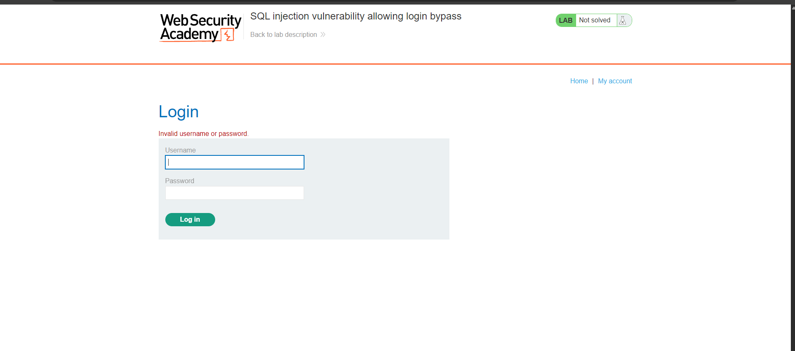
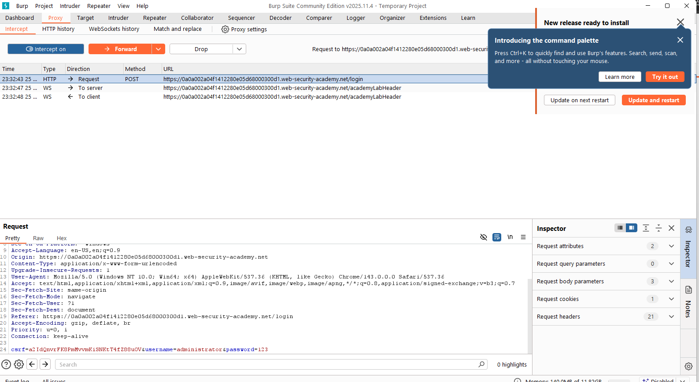
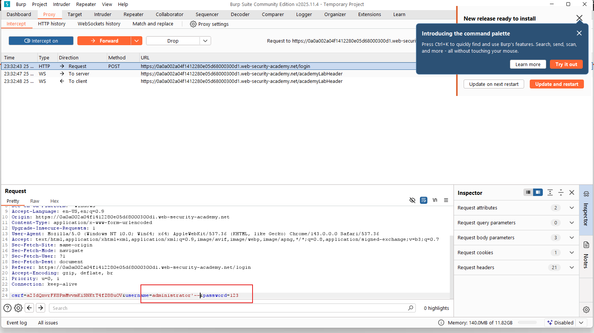
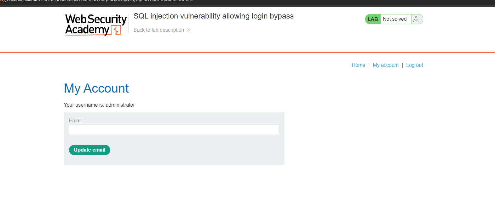
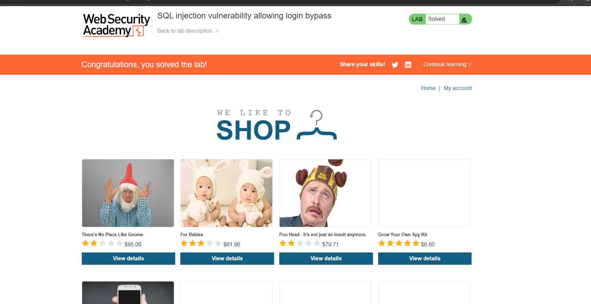

# 🔓 Lab: SQL injection vulnerability allowing login bypass

---

## Mô tả

Lab này có lỗ hổng SQL injection trong chức năng đăng nhập. Bằng cách chặn request đăng nhập và sửa tham số `username` thành `administrator'--`, ta có thể “comment out” phần kiểm tra mật khẩu, từ đó đăng nhập vào tài khoản `administrator` mà không cần biết mật khẩu.

## Các bước thực hiện

### Bước 1: Bật chặn request đăng nhập bằng Burp Suite

1. Mở Burp Suite, vào **Proxy → Intercept** và bật **Intercept is on**.
2. Trên trình duyệt, truy cập trang **Login** của lab và nhập thử bất kỳ `username/password`.
3. Click **Login** để tạo request đăng nhập và để Burp chặn lại.

### Bước 2: Gửi request sang Repeater để chỉnh sửa

1. Trong tab Intercept, quan sát cấu trúc truy vấn

### Bước 3: Chỉnh payload SQLi để bypass đăng nhập

Tìm tham số `username`  và thay giá trị của nó thành:

`administrator'--`

Giữ `password` là bất kỳ giá trị nào.

### Bước 4: Gửi request và xác nhận đã đăng nhập admin

1. Click **Send** trong Repeater.
2. Kiểm tra response:
	- Thường sẽ thấy redirect về trang sau đăng nhập và/hoặc có `Set-Cookie` session.
	- Trang hiển thị đang đăng nhập với vai trò `administrator`.

### Bước 5: Hoàn thành lab

Sau khi request đăng nhập thành công với user `administrator`, quay lại trình duyệt (hoặc dùng session/cookie từ response) để vào trang admin/hoàn thành điều kiện của lab.

